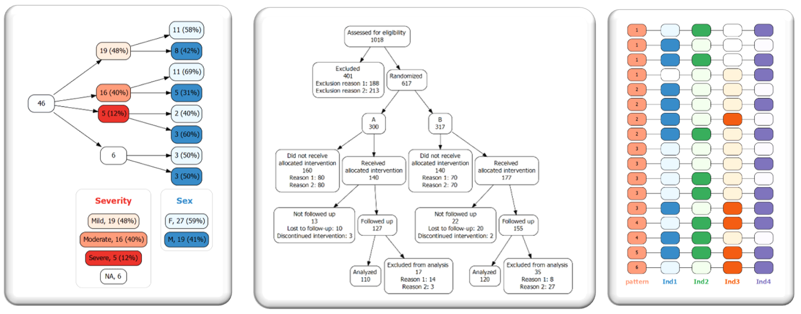
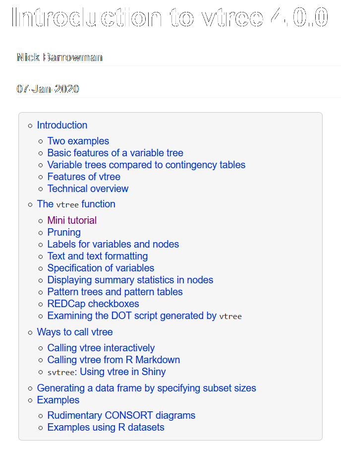
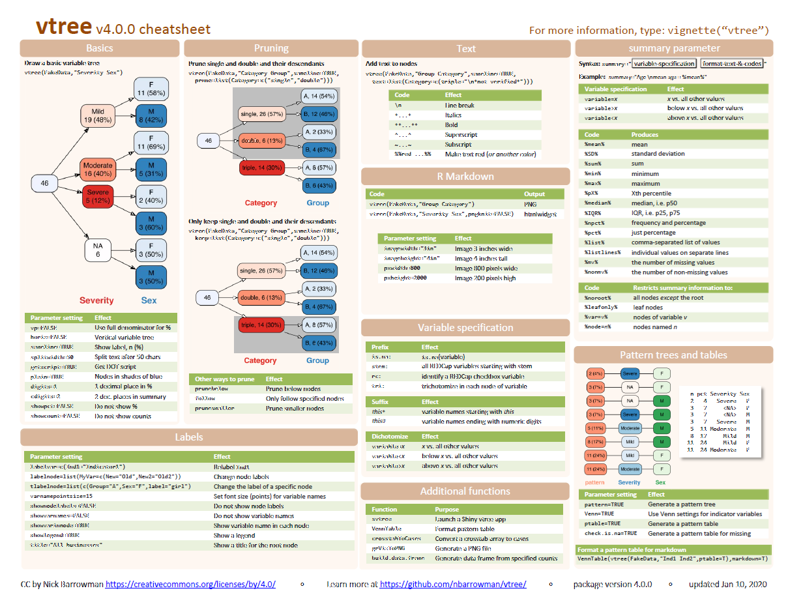
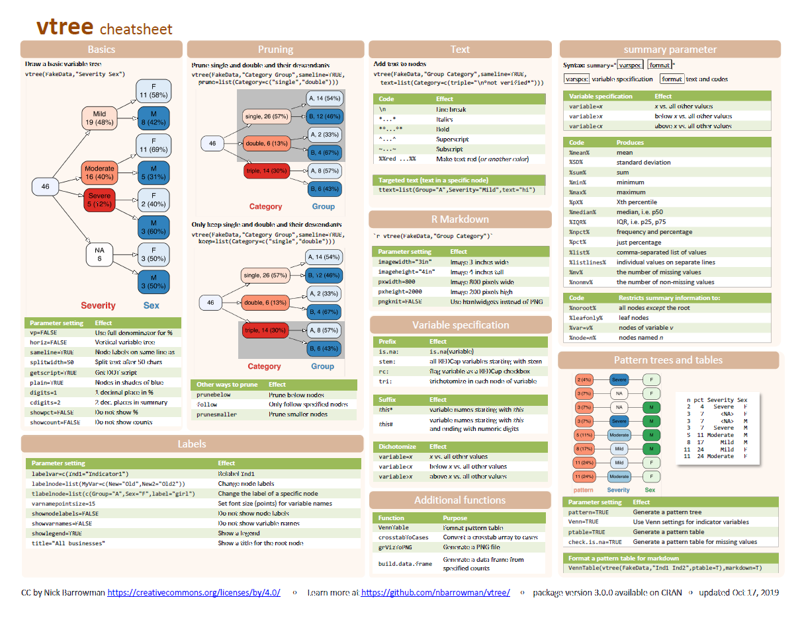

vtree is used to calculate and draw *variable trees* like the one below:

## Gallery

## Vignette

## Cheatsheet

### Version 4

 
<a href="cheatsheets/vtree_cheatsheet_4.0.0.pdf">Download pdf</a>

### Version 3

 
<a href="https://github.com/rstudio/cheatsheets/raw/master/vtree.pdf">Download pdf</a>

## Short tutorial videos on YouTube

### Introduction to vtree
<iframe width="560" height="315" src="https://www.youtube.com/embed/okcjcXpAOt4" frameborder="0" allow="accelerometer; autoplay; encrypted-media; gyroscope; picture-in-picture" allowfullscreen></iframe>

### Pruning
<iframe width="560" height="315" src="https://www.youtube.com/embed/iwa5yVG_AIA" frameborder="0" allow="accelerometer; autoplay; encrypted-media; gyroscope; picture-in-picture" allowfullscreen></iframe>

## Powerpoint presentation

Here's a short [powerpoint presentation](https://nbarrowman.github.io/vtree%20-%20An%20R%20Package%20for%20Calculating%20and%20Drawing%20Variable%20Trees.pptx) (10.4 MB) on vtree that was presented at the Canadian Research Software Conference in Montreal on May 28, 2019.
