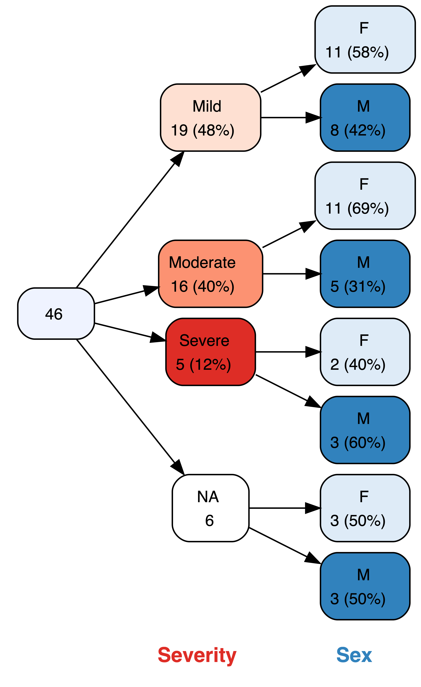
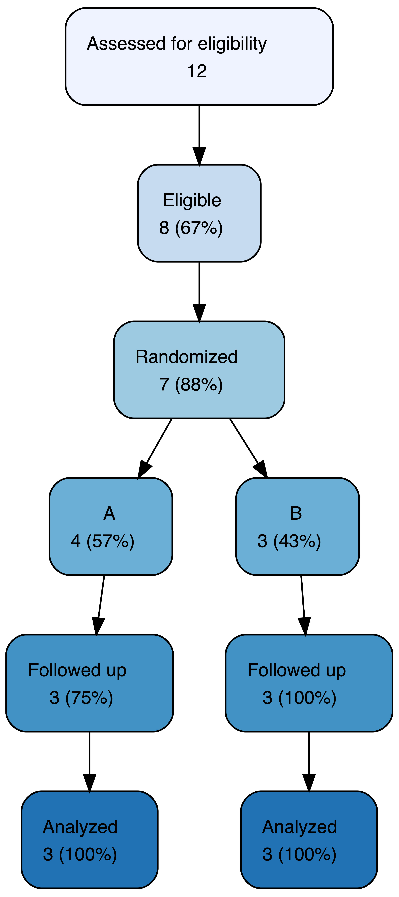
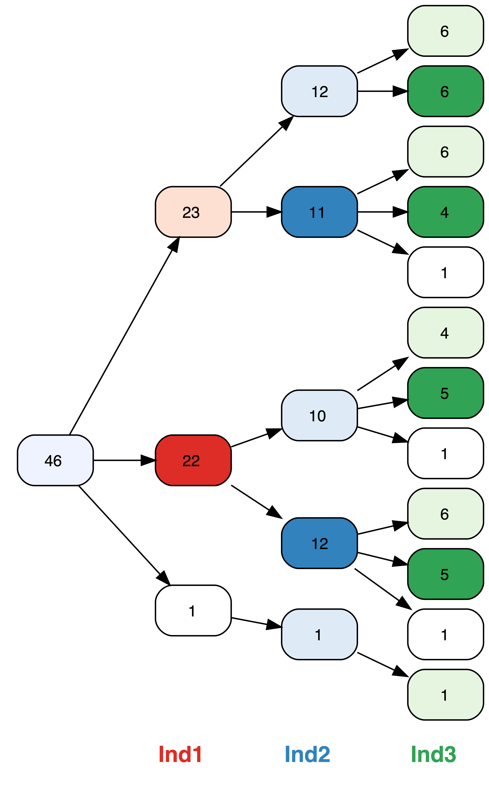

**vtree** is my R package for calculating and drawing what I call *variable trees*. vtree is available on [CRAN](https://cran.r-project.org/package=vtree). For more information, see the [GitHub page for vtree](https://github.com/nbarrowman/vtree).

&nbsp;&nbsp;&nbsp;&nbsp;&nbsp;&nbsp;&nbsp;&nbsp;&nbsp;&nbsp;&nbsp;&nbsp;&nbsp;&nbsp;&nbsp;&nbsp;

Here's a short [powerpoint presentation](https://nbarrowman.github.io/vtree%20-%20An%20R%20Package%20for%20Calculating%20and%20Drawing%20Variable%20Trees.pptx) (10.4 MB) that I gave at the Canadian Research Software Conference in Montreal on May 28, 2019.

# Introduction to vtree
<iframe width="560" height="315" src="https://www.youtube.com/embed/okcjcXpAOt4" frameborder="0" allow="accelerometer; autoplay; encrypted-media; gyroscope; picture-in-picture" allowfullscreen></iframe>

# Pruning
<iframe width="560" height="315" src="https://www.youtube.com/embed/iwa5yVG_AIA" frameborder="0" allow="accelerometer; autoplay; encrypted-media; gyroscope; picture-in-picture" allowfullscreen></iframe>
