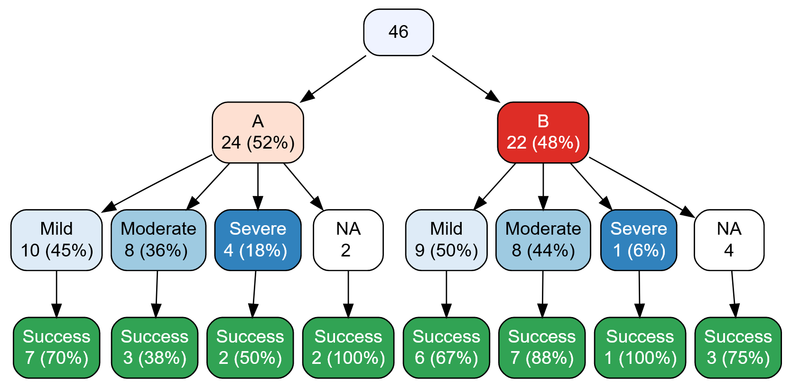

 

vtree is used to generate <i>variable trees</i>, like the one above.

## Gallery

## Vignette

## Cheatsheet

 
<a href="cheatsheets/vtree_cheatsheet_4.0.0.pdf">Download pdf</a>

## Short tutorial videos

### Introduction to vtree
<iframe width="560" height="315" src="https://www.youtube.com/embed/okcjcXpAOt4" frameborder="0" allow="accelerometer; autoplay; encrypted-media; gyroscope; picture-in-picture" allowfullscreen></iframe>

### Pruning
<iframe width="560" height="315" src="https://www.youtube.com/embed/iwa5yVG_AIA" frameborder="0" allow="accelerometer; autoplay; encrypted-media; gyroscope; picture-in-picture" allowfullscreen></iframe>

### CONSORT-style flow diagrams

<iframe width="560" height="315" src="https://www.youtube.com/embed/-gOw6es-1Xs" frameborder="0" allow="accelerometer; autoplay; encrypted-media; gyroscope; picture-in-picture" allowfullscreen></iframe>

## Tutorials

<a href="https://rpubs.com/nbarrowman/CONSORT-style">CONSORT-style diagrams</a>

<a href="https://rpubs.com/nbarrowman/pruning_a_variable_tree">How to prune variable trees</a>

<a href="https://rpubs.com/nbarrowman/Data_exploration_with_vtree">Data exploration example 1</a>

<a href="https://rpubs.com/nbarrowman/missing_values_vtree">Data exploration example 2: missing values</a>

## Powerpoint presentation

A short [powerpoint](https://nbarrowman.github.io/vtree%20-%20An%20R%20Package%20for%20Calculating%20and%20Drawing%20Variable%20Trees.pptx) (10.4 MB) about vtree that was presented at the Canadian Research Software Conference in Montreal on May 28, 2019.

 

<small>
vtree is open source software 
designed by <a href="https://nick-barrowman.carrd.co">Nick Barrowman</a> 
with contributions from Sebastian Gatscha. 
 
vtree is an <a href="https://www.r-project.org/">R</a> package
built on open-source software including:
<a href="http://rich-iannone.github.io/DiagrammeR/">DiagrammeR</a>,
<a href="https://www.graphviz.org/">Graphviz</a>,
<a href="https://www.htmlwidgets.org/">htmlwidgets</a>, 
<a href="https://rstudio.com/products/shiny/">Shiny</a>,
and
<a href="https://github.com/ariutta/svg-pan-zoom">svg-pan-zoom</a>.
</small>

